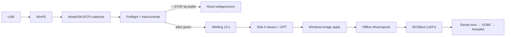

# RSS — Surface Deployment Stick

**Volledig geautomatiseerde Windows 11-deploymentstick voor Microsoft Surface Laptop — offline, reproduceerbaar en faalveilig.**

[](https://github.com/Cyxno/rss-surface-deployment-public/actions/workflows/validate.yml)
[](../../releases)
[](https://learn.microsoft.com/powershell/)
[]()
[]()

> [!WARNING]
> **Deze stick wist de interne NVMe-schijf (Disk 0) zonder bevestigingsvraag** — na een volledige preflight en een aftelling van 15 seconden. Gebruik de stick uitsluitend op een daarvoor aangewezen Surface Laptop waarvan de gegevens bewust mogen worden verwijderd. Onzekere situaties leiden altijd tot een veilige stop vóór de eerste schrijfactie.

---

## Wat is RSS?

RSS boot een Surface Laptop vanaf USB in een volledig automatische WinPE-omgeving: het detecteert model, SystemSKU en CPU, controleert de media- en schijfsituatie inclusief SHA-256 van image en driverarchief, wist daarna pas de interne schijf, installeert Windows 11 Pro (Nederlands) met het volledige officiële Surface-driverpakket offline geïnjecteerd, en eindigt in een normale OOBE die klaar is voor Autopilot/Intune. Er is geen toetsenbord, muis of interactie nodig.



## Ondersteunde hardware

<!-- BEGIN GENERATED:sources — wordt ververst door tools/Build-Documentation.ps1 -->
| Profiel | Model | Platform | Driverpakket van | INF | Fysieke status |
|---|---|---|---|---|---|
| SF4 | Surface Laptop 4 (AMD) | AMD | 2026-08-14 | 78 | ❌ **NOT PHYSICALLY VALIDATED** |
| SF5 | Surface Laptop 5 (Intel, consumer + for Business) | Intel | 2026-09-22 | 112 | ✅ fysiek gevalideerd |
| SF6 | Surface Laptop 6 for Business (Intel) | Intel | 2026-09-22 | 116 | ✅ fysiek gevalideerd |
| SF7 | Surface Laptop for Business 7th Edition with Intel | Intel | 2026-09-22 | 119 | ✅ fysiek gevalideerd | 
| SF8 | Surface Laptop for Business 8th Edition with Intel (NIET Snapdragon/ARM) | Intel | 2026-09-11 | 120 | ✅ fysiek gevalideerd |

**Productiemedium:** Windows 11 Pro 25H2, build 26200.9457 (LCU KB5129195, 2026-09-14), nl-NL · ADK 10.1.26100.9457 · wimlib 1.14.5 · boot.wim SHA-256 `797CCD8…ECEA0563`
<!-- EIND GENERATED:sources -->

**Expliciet niet ondersteund** (veilige stop, niets wordt geschreven): alle andere Surface- en non-Surface-modellen, ARM/Snapdragon-varianten (o.a. Surface Laptop 7th/8th Edition Snapdragon), Surface Laptop 5G for Business 7th Edition (apart driverpakket) en de Intel-variant van de Surface Laptop 4. De detectie controleert naam, SystemSKU (allowlist uit het manifest) én CPU-fabrikant; "supported" betekent níét automatisch "fysiek getest" — zie de statuskolom hierboven.

## Wat is er zeker?

RSS onderscheidt vier valideringsniveaus die niet door elkaar mogen worden gehaald:

| Niveau | Betekenis | Waar zichtbaar |
|---|---|---|
| **code validated** | CI groen: syntax, linting, 33 guardrailtests, manifestconsistentie, secretscan | GitHub Actions per commit |
| **media validated** | read-only stickvalidatie 0 FAIL op een gebouwde stick | `RSS-Media-Validation.txt` op de stick |
| **physically validated** | volledige deployment + eerste boot op fysieke hardware, per model | tabel hierboven + manifest |
| **production approved** | releasegates afgetikt, tag + checksums | releases + `checksums/` |

## Repository-layout

```text
├── .github/            CI-workflow, issue- en PR-templates
├── config/
│   ├── sources.json    CANONICAAL manifest: versies, modellen, SKU's, hashes, INF-aantallen
│   └── load-orders/    bewezen WinPE-driverlaadvolgordes per profiel
├── docs/
│   ├── source/         canonical documentatiebronnen (Markdown, met manifest-tokens)
│   ├── generated/      gegenereerde DOCX/PDF-handleidingen + stickdocumentatie
│   ├── TESTMATRIX.md   fysieke testmatrix per model
│   ├── MEDIA-LAYOUT.md partitie- en mappenstructuur van de stick
│   └── PHYSICAL-TEST-QUICKLIST.md   invulbare fysieke testchecklist
├── src/winpe/          RSS-SafetyLib.ps1 (beslisfuncties), RSS-Deploy.ps1, Build-WinPE.ps1, startnet.cmd
├── tools/              Update-RSSMedia.ps1, Validate-RSSMedia.ps1, Test-DriverArchives.ps1,
│                       Build-Documentation.ps1, Build-Checksums.ps1, Test-ManifestConsistency.ps1,
│                       Collect-RSSOOBEDiag.ps1
├── tests/              Pester-guardrailtests (gemockt — raken nooit echte disks)
└── checksums/          SHA256SUMS.txt over alle Git-bestanden
```

**Bewust níét in Git:** Windows-images, ADK/WinPE-bestanden, Surface-driverpakketten, uitgepakte drivers, gegenereerde WIM/ESD en deploymentlogs. Alles is reproduceerbaar vanuit officiële Microsoft-bronnen via het manifest + `tools/Update-RSSMedia.ps1`.

## Snel beginnen (stick vernieuwen)

1. Lees de technische handleiding (`docs/generated/RSS_Technische_bouw_en_beheerhandleiding.pdf`).
2. Installeer ADK 10.1.26100.9457 + WinPE-add-on en wimlib 1.14.5 (links en hashes: `config/sources.json`).
3. Zet de geservicede Windows-bron klaar (UUP-set, zie manifest) en sluit uitsluitend de doel-USB aan.
4. Voer gefaseerd uit: `tools\Update-RSSMedia.ps1 -Phase All -UsbDiskNumber <n> -SourceInstallWim <install.wim>` (downloadt, verifieert, bouwt en assembleert; weigert Disk 0 en niet-USB-media).
5. Valideer read-only: `tools\Validate-RSSMedia.ps1` → 0 FAIL vereist.
6. Fysieke test per model (zie `docs/TESTMATRIX.md` en `docs/PHYSICAL-TEST-QUICKLIST.md`) vóór productievrijgave.

Documentatie regenereren: `tools\Build-Documentation.ps1` (pandoc + Typst; produceert DOCX/PDF en stickdocumentatie uit `docs/source` + `config/sources.json`). Checksums na elke wijziging: `tools\Build-Checksums.ps1`.

## Validatie en tests

| Laag | Commando | Dekking |
|---|---|---|
| Guardrails (gemockt) | `Invoke-Pester -Path tests` | ondersteund model, onbekend model, lege/onbekende/weiger-SKU, SF7 5G, SF8 Snapdragon, ARM-naam, CPU-mismatch, geen/meerdere NVMe, NVMe≠Disk 0, USB op Disk 0, USB = doelschijf, nul/meerdere datapartities, ontbrekende archieven, hash-mismatch, incompleet manifest — alles STOP |
| Stick (read-only) | `tools\Validate-RSSMedia.ps1` | bestanden, hashes, boot.wim, manifest-identiteit, KB's, INF-aantallen, load-orders, syntax, guardrail-aanwezigheid, MDM/OOBE-vrije logica |
| Manifest | `tools\Test-ManifestConsistency.ps1` | structuur, hash-formaat, URL-hosts, outputs, checksums (ook in CI) |
| CI | `.github/workflows/validate.yml` | PSScriptAnalyzer, Pester, manifestconsistentie, interne links, secretscan, geen binaries in Git |

De tests wijzigen nooit een echte disk; fysieke tests blijven een aparte, verplichte stap (quicklist + matrix in `docs/`).

## Beheer, security en privacy

- **Geen secrets** (wachtwoorden, tokens, productsleutels, serienummers) in Git of logs; CI controleert dit met gitleaks en een binary-scan.
- **Offline by design:** de deployment gebruikt nooit internet; downloads gebeuren uitsluitend in het onderhoudsscript tegen manifest-URL's met SHA-256 + Authenticode-controle.
- **Geen OOBE-bypass:** geen unattend, geen lokale account, geen `ms-cxh:localonly`/BypassNRO — de installatie blijft Autopilot/MDM-geschikt; de validatie faalt bewust op deze patronen.
- Wijzig een werkende productiestick nooit rechtstreeks; bouw, valideer en test eerst een kandidaatstick.
- Versies, modellen en hashes staan op precies één plek: `config/sources.json`. Drift daartegen wordt door validatie en CI gemarkeerd.

## Releaseproces

`code validated` → `media validated` → `physically validated` → `production approved`, met tags volgens semver (`vX.Y.Z`). Gates en sign-off: `docs/generated/RSS_Test_en_releaseprocedure.pdf` en `CHANGELOG.md`. Een release vereist CI groen, stickvalidatie 0 FAIL, fysieke tests per beoogd model en gedocumenteerde known limitations.

## Troubleshooting

Evidence-based symptoom→oorzaak→diagnose→oplossing voor boot, WinPE-invoer, NVMe, driverload-order, DISM/WIM, OOBE-hang (NCSI/Autopilot/Microsoft-service), hash-mismatches en corrupte media: hoofdstuk 18 van de technische handleiding. Voor OOBE-diagnose op locatie: `tools\Collect-RSSOOBEDiag.ps1` (read-only, Shift+F10).

## Disclaimer

Deze repository wordt 'as-is' beschikbaar gesteld: er is geen opensourcelicentie toegekend en gebruik is voor eigen risico. RSS wist schijven: gebruik impliceert dat de gebruiker bevoegd en geïnformeerd is. Microsoft, Surface en Windows zijn trademarks van Microsoft Corporation; RSS is geen Microsoft-product.
