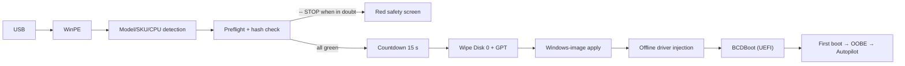

# RSS — Surface Deployment Stick

**Fully automated Windows 11 deployment stick for Microsoft Surface Laptop — offline, reproducible and fail-safe.**

[](https://github.com/Cyxno/rss-surface-deployment-public/actions/workflows/validate.yml)
[](LICENSE)
[](https://github.com/Cyxno/rss-surface-deployment-public/releases)
[](https://learn.microsoft.com/powershell/)
[](https://learn.microsoft.com/windows-hardware/manufacture/desktop/winpe-intro)
[](#validation-and-tests)

> [!WARNING]
> **This stick wipes the internal NVMe disk (Disk 0) without a confirmation prompt** — after a full preflight and a countdown of 15 seconds. Use the stick only on a Surface Laptop designated for this purpose whose data may deliberately be erased. Uncertain situations always lead to a safe stop before the first write action.

---

## What is RSS?

RSS boots a Surface Laptop from USB into a fully automatic WinPE environment: it detects the model, SystemSKU and CPU, checks the media and disk situation including the SHA-256 of the image and driver archive, only then wipes the internal disk, installs Windows 11 Pro (Dutch) with the full official Surface driver package injected offline, and ends in a normal OOBE that is ready for Autopilot/Intune. No keyboard, mouse or interaction is required.



## Supported hardware

<!-- BEGIN GENERATED:sources — refreshed by tools/Build-Documentation.ps1 -->
| Profile | Model | Platform | Driver package from | INF | Physical status |
|---|---|---|---|---|---|
| SF4 | Surface Laptop 4 (AMD) | AMD | 2026-08-14 | 78 | ✅ physically validated (2026-10) |
| SF5 | Surface Laptop 5 (Intel, consumer + for Business) | Intel | 2026-09-22 | 112 | ✅ physically validated (2026-10) |
| SF6 | Surface Laptop 6 for Business (Intel) | Intel | 2026-09-22 | 116 | ✅ physically validated (2026-09) |
| SF7 | Surface Laptop for Business 7th Edition with Intel | Intel | 2026-09-22 | 119 | ✅ physically validated (2026-10) |
| SF8 | Surface Laptop for Business 8th Edition with Intel (NOT Snapdragon/ARM) | Intel | 2026-09-11 | 120 | ✅ physically validated (2026-10) |

**Production medium:** Windows 11 Pro 25H2, build 26200.9457 (LCU KB5129195, 2026-09-14), nl-NL · ADK 10.1.26100.9457 · wimlib 1.14.5 · boot.wim SHA-256 `797CCD8…ECEA0563`
<!-- EIND GENERATED:sources -->

**Explicitly not supported** (safe stop, nothing is written): all other Surface and non-Surface models, ARM/Snapdragon variants (including Surface Laptop 7th/8th Edition Snapdragon), Surface Laptop 5G for Business 7th Edition (separate driver package) and the Intel variant of the Surface Laptop 4. Detection checks the name, the SystemSKU (allowlist from the manifest) and the CPU manufacturer; "supported" does not automatically mean "physically tested" — see the status column above.

## What is guaranteed?

RSS distinguishes four validation levels that must not be confused with one another:

| Level | Meaning | Where visible |
|---|---|---|
| **code validated** | CI green: syntax, linting, 33 guardrail tests, manifest consistency, secret scan | GitHub Actions per commit |
| **media validated** | read-only stick validation 0 FAIL on a built stick | `RSS-Media-Validation.txt` on the stick |
| **physically validated** | full deployment + first boot on physical hardware, per model | table above + manifest |
| **production approved** | release gates ticked off, tag + checksums | releases + `checksums/` |

## Repository layout

```text
├── .github/            CI workflow, issue and PR templates
├── config/
│   ├── sources.json    CANONICAL manifest: versions, models, SKUs, hashes, INF counts
│   └── load-orders/    proven WinPE driver load orders per profile
├── docs/
│   ├── source/         canonical documentation sources (Markdown, with manifest tokens)
│   ├── generated/      generated DOCX/PDF manuals + stick documentation
│   ├── TESTMATRIX.md   physical test matrix per model
│   ├── MEDIA-LAYOUT.md partition and folder structure of the stick
│   └── PHYSICAL-TEST-QUICKLIST.md   fillable physical test checklist
├── src/winpe/          RSS-SafetyLib.ps1 (decision functions), RSS-Deploy.ps1, Build-WinPE.ps1, startnet.cmd
├── tools/              Update-RSSMedia.ps1, Validate-RSSMedia.ps1, Test-DriverArchives.ps1,
│                       Build-Documentation.ps1, Build-Checksums.ps1, Test-ManifestConsistency.ps1,
│                       Collect-RSSOOBEDiag.ps1
├── tests/              Pester guardrail tests (mocked — never touch real disks)
└── checksums/          SHA256SUMS.txt covering all Git files
```

**Deliberately not in Git:** Windows images, ADK/WinPE files, Surface driver packages, extracted drivers, generated WIM/ESD and deployment logs. Everything is reproducible from official Microsoft sources via the manifest + `tools/Update-RSSMedia.ps1`.

## Quick start (refreshing the stick)

1. Read the technical manual (`docs/generated/RSS_Technical_Build_and_Management_Manual.pdf`).
2. Install ADK 10.1.26100.9457 + the WinPE add-on and wimlib 1.14.5 (links and hashes: `config/sources.json`).
3. Prepare the serviced Windows source (UUP set, see the manifest) and connect only the target USB drive.
4. Run in phases: `tools\Update-RSSMedia.ps1 -Phase All -UsbDiskNumber <n> -SourceInstallWim <install.wim>` (downloads, verifies, builds and assembles; refuses Disk 0 and non-USB media).
5. Validate read-only: `tools\Validate-RSSMedia.ps1` → 0 FAIL required.
6. Physical test per model (see `docs/TESTMATRIX.md` and `docs/PHYSICAL-TEST-QUICKLIST.md`) before production release approval.

To regenerate the documentation: `tools\Build-Documentation.ps1` (pandoc + Typst; produces DOCX/PDF and stick documentation from `docs/source` + `config/sources.json`). Checksums after every change: `tools\Build-Checksums.ps1`.

## Validation and tests

| Layer | Command | Coverage |
|---|---|---|
| Guardrails (mocked) | `Invoke-Pester -Path tests` | supported model, unknown model, empty/unknown/refused SKU, SF7 5G, SF8 Snapdragon, ARM name, CPU mismatch, no/multiple NVMe, NVMe≠Disk 0, USB on Disk 0, USB = target disk, zero/multiple data partitions, missing archives, hash mismatch, incomplete manifest — all STOP |
| Stick (read-only) | `tools\Validate-RSSMedia.ps1` | files, hashes, boot.wim, manifest identity, KBs, INF counts, load orders, syntax, guardrail presence, MDM/OOBE-free logic |
| Manifest | `tools\Test-ManifestConsistency.ps1` | structure, hash format, URL hosts, outputs, checksums (also in CI) |
| CI | `.github/workflows/validate.yml` | PSScriptAnalyzer, Pester, manifest consistency, internal links, secret scan, no binaries in Git |

The tests never modify a real disk; physical testing remains a separate, mandatory step (quicklist + matrix in `docs/`).

## Management, security and privacy

- **No secrets** (passwords, tokens, product keys, serial numbers) in Git or logs; CI enforces this with gitleaks and a binary scan.
- **Offline by design:** the deployment never uses the internet; downloads happen only in the maintenance script, against manifest URLs with SHA-256 + Authenticode verification.
- **No OOBE bypass:** no unattend, no local account, no `ms-cxh:localonly`/BypassNRO — the installation remains Autopilot/MDM-ready; validation deliberately fails on these patterns.
- Never modify a working production stick directly; build, validate and test a candidate stick first.
- Versions, models and hashes live in exactly one place: `config/sources.json`. Drift from it is flagged by validation and CI.

## Release process

`code validated` → `media validated` → `physically validated` → `production approved`, with tags following semver (`vX.Y.Z`). Gates and sign-off: `docs/generated/RSS_Test_and_Release_Procedure.pdf` and `CHANGELOG.md`. A release requires CI green, stick validation 0 FAIL, physical tests per intended model and documented known limitations.

## Troubleshooting

Evidence-based symptom→cause→diagnosis→solution for boot issues, WinPE input, NVMe, driver load order, DISM/WIM, OOBE hangs (NCSI/Autopilot/Microsoft service), hash mismatches and corrupt media: chapter 18 of the technical manual. For on-site OOBE diagnostics: `tools\Collect-RSSOOBEDiag.ps1` (read-only, Shift+F10).

## Disclaimer

RSS wipes disks: using it implies the user is authorized and informed. Microsoft, Surface and Windows are trademarks of Microsoft Corporation; RSS is not a Microsoft product.

## License

Copyright (C) 2026 Cyxno. This repository is licensed under the **GNU Affero General Public License v3.0 only** (AGPL-3.0-only) — see [LICENSE](LICENSE) and [NOTICE.md](NOTICE.md).
